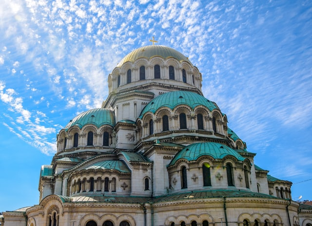

# The Syntaxfest 2021 in Sofia

### 4 events for 1 Fest of Empirical Syntax

 The second edition of the SyntaxFest brings together again four events with partially overlapping research topics including empirical syntax, linguistic annotation, statistical language analysis, and Natural Language Processing:
* Quasy : The Workshop on Quantitative Syntax
* [Depling](https://depling.org/depling2021/) : The Conference on Dependency Linguistics
* TLT : The International Workshop on Treebanks and Linguistic Theories 
* UDW : The Universal Dependencies Workshop

The next and second edition will be held in Sofia from 21 March to 25 March 2022

### Venue

The event will be held at [Sofia University "St. Kl. Ohridski"](https://www.uni-sofia.bg/index.php/eng)

<small>Photo by<a href="https://unsplash.com/@inedelchev?utm_source=unsplash&amp;utm_medium=referral&amp;utm_content=creditCopyText">Ivan Nedelchev</a> on <a href="https://unsplash.com/s/photos/sofia?utm_source=unsplash&amp;utm_medium=referral&amp;utm_content=creditCopyText">Unsplash</a></small>

